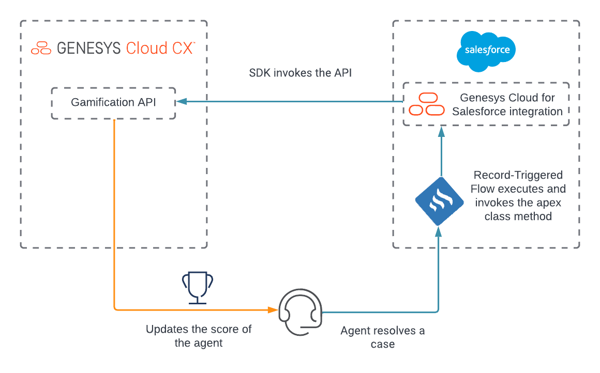

# Integrate a Salesforce metric to Genesys Cloud's Gamification system

View the [Integrate a Salesforce metric to Genesys Cloud's Gamification system blueprint](https://developer.genesys.cloud/blueprints/ "Opens the Genesys Cloud Developer page").

This Genesys Cloud Developer Blueprint demonstrates how to configure external metrics in Genesys Cloud and how to use the Gamification API to update the external metric values from Salesforce or any third-party system.

You can view the complete blueprint and download the sample files from [here](./blueprint).

