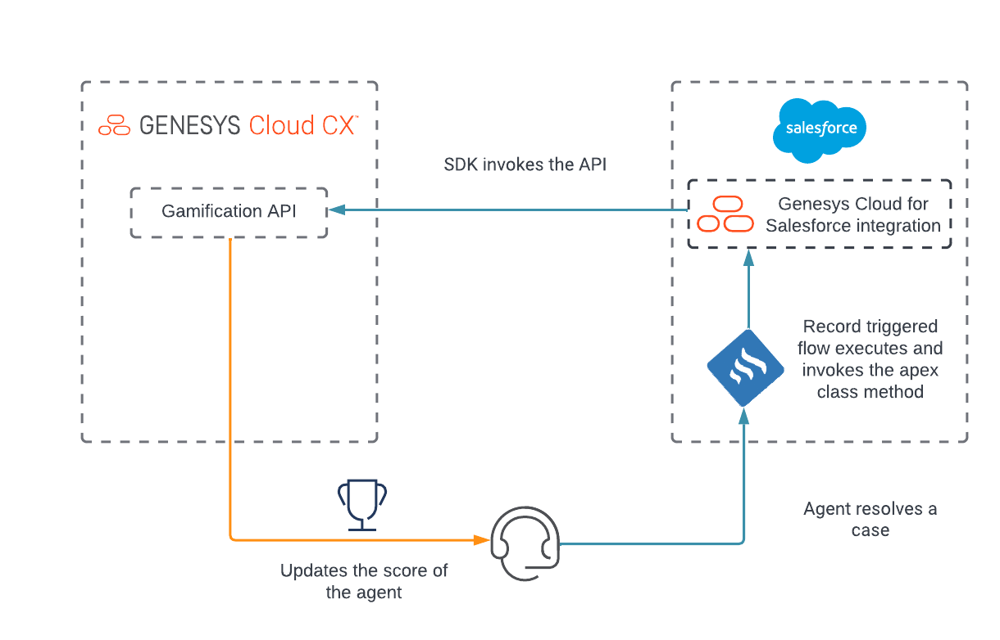
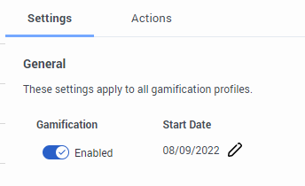
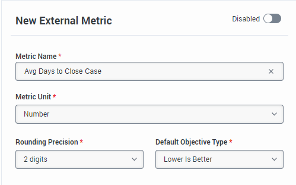
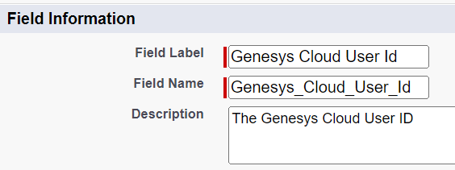
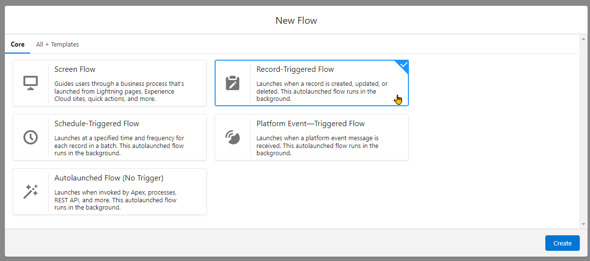
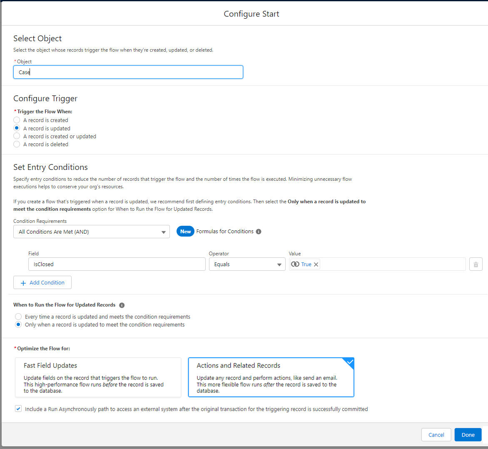
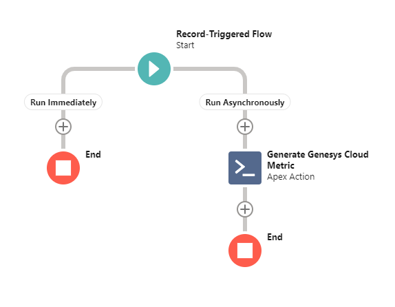
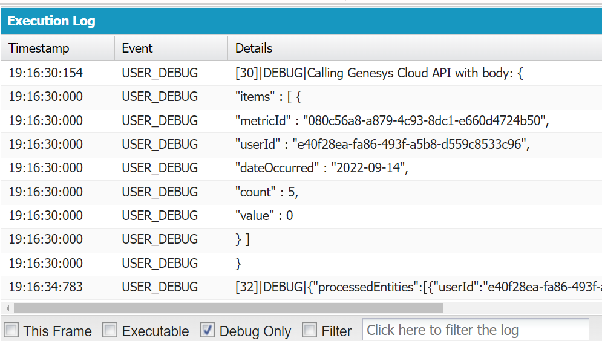

This Genesys Cloud Developer Blueprint demonstrates how to configure external metrics in Genesys Cloud and how to use the Gamification API to update the external metric values from Salesforce or any third-party system.



## Scenario

An organization using the Gamification features of Genesys Cloud wants to add external metrics to score and rank their agents.

## Solution

The blueprint uses the Salesforce metric that tracks the average number of days a user takes to resolve a case.

You can use this solution with any other metric or with any third-party system and invoke the Gamification API to send daily value updates.

## Solution components

* **Genesys Cloud** - A suite of Genesys cloud services for enterprise-grade communications, collaboration, and contact center management. In this solution, you need a Genesys Cloud user account and Genesys Cloud for Salesforce integration.
* **Salesforce** - The Salesforce Cloud Customer Relationship Management (CRM) platform.
* **Genesys Cloud for Salesforce managed package** - The managed package contains all the installation components, including the Genesys Cloud for Salesforce SDK that is necessary to run Genesys Cloud for Salesforce.
* **Genesys Cloud for Salesforce SDK** - Allows you to customize actions in Genesys Cloud for Salesforce. The managed package includes the SDK and uses the Salesforce Apex programming language.

## Prerequisites

### Specialized knowledge

* Administrator-level knowledge of Genesys Cloud
* Administrator-level knowledge of Salesforce and programming experience with Apex code

### Genesys Cloud account requirements

* A Genesys Cloud license. For more information, see [Genesys Cloud Pricing](https://www.genesys.com/pricing "Opens the Genesys Cloud pricing page").
* [Genesys Cloud 3 license](https://www.genesys.com/pricing "Genesys Cloud 3 license") or [Genesys Cloud User 1 WEM Upgrade II](https://appfoundry.genesys.com/filter/genesyscloud/listing/814c259b-7e36-48e6-b6d2-5355b4146227 "Genesys Cloud User 1 WEM Upgrade II") or [Genesys Cloud User 2 WEM Upgrade I](https://appfoundry.genesys.com/filter/genesyscloud/listing/253f2cbb-5f9d-4349-a54e-1e8dd4a0f8a5 "Genesys Cloud User 2 WEM Upgrade I").
* Master Admin role in Genesys Cloud. For more information, see [Roles and permissions overview](https://help.mypurecloud.com/?p=24360 "Opens the Roles and permissions overview article") in the Genesys Cloud Resource Center.
* An OAuth client with roles that are assigned with the Gamification permissions. For more information, see [OAuth client permissions for Genesys Cloud for Salesforce](https://help.mypurecloud.com/?p=188903 "Opens the OAuth client permissions for Genesys Cloud for Salesforce article") and [Create an OAuth client](https://help.mypurecloud.com/?p=188023 "Opens the Create an OAuth client article") in the Genesys Cloud Resource Center.

### Salesforce account requirements

* A Salesforce organization with the Genesys Cloud for Salesforce integration installed and configured. For more information, see [Install or upgrade the Genesys Cloud for Salesforce managed package](https://help.mypurecloud.com/?p=39356/ "Goes to the Install or upgrade the Genesys Cloud for Salesforce managed package article") and [Set up a call center in Salesforce](https://help.mypurecloud.com/?p=10593 "Goes to the Set up a call center in Salesforce article") in the Genesys Cloud Resource Center.
* The solutions engineer must be assigned a System Administrator profile. For more information, see [Standard Profiles](https://help.salesforce.com/s/articleView?id=sf.standard_profiles.htm&type=5 "Opens the Standard Profiles page") in the Salesforce documentation.

## Gamification API

Before implementing the sample, learn about the [Write External Metric Data API endpoint](https://developer.genesys.cloud/devapps/api-explorer#post-api-v2-employeeperformance-externalmetrics-data "Goes to the API Explorer Gamification API page"). This API allows you to update the daily value of an external metric.

The sample body of the API:

```JSON
{
    "items": [
        {
            "metricId": "aaaaaaa-aaaa-aaaa-aaaa-aaaaaaaaaaaa",
            "userId": "zzzzzzz-zzzz-zzzz-zzzz-zzzzzzzzzzzz",
            "dateOccurred": "2022-08-29",
            "value": 300,
            "count": 20
        }
    ]   
}
```

* `items` is an array that contains the update to a specific metric for a specific user. To update multiple metrics or multiple users, add multiple items in the array.

* `dateOccurred` is the date of recording the specific metric value. You can set this date to be between 7 days in the past and 30 days ahead of the current date. If you invoke the API on the same date that you have added in the API, then the API overrides the `value` and `count` properties. Since the `value` data does not automatically accumulate, the data is pre-aggregated and finalized in the external system whenever the API is invoked.

* `value` is the numeric value that represents the metric. In the sample API, it represents the number of days it took to resolve the cases.

* `count` is the number of data points. In the sample API, it is the number of cases resolved on the day.

Using this API information to update a metric externally, you can now create an automated way in Salesforce to send these updates to Genesys Cloud.

## Implementation steps

### Turn on Gamification settings on Genesys Cloud

By default, Gamification is turned off for an organization. To turn it on in Genesys Cloud, navigate to **Admin > Performance & Engagement > Gamification Settings** and enable the **Gamification** toggle.



### Create an external metric in Genesys Cloud

To create an external metric in Genesys Cloud:

1. Navigate to **Admin > Performance & Engagement > External Metric Definitions**.
2. Enter the external metric details as shown in the illustration:

    

3. Click **Save Metric**.
4. Note the **External ID** for later use in the Salesforce configuration.

For more information, see [Configure external metrics for performance scorecards](https://help.mypurecloud.com/articles/configure-external-metrics-for-performance-scorecards/ "Goes to the Configure external metrics for performance scorecards article") in the Genesys Cloud Resource Center.

### Add the metric to a Gamification profile

Create a Gamification profile or use an existing profile and add the external metric that you created to it.

To create or edit a profile in Genesys Cloud:

1. Navigate to **Admin > Performance & Engagement > Gamification Profiles**.
2. Create or edit an existing profile.
3. Under the **Metrics** tab, add the metric that you created.
4. To get the number of days an agent takes to close a case, edit the metric and select **Lower is Better** in the **Objective Type** list for the metric.

### Create a custom user field in Salesforce to associate with Genesys Cloud User Id

To associate the users in Salesforce with their Genesys Cloud user accounts, create a custom field for the user mapping in Salesforce.

For more information, see [Create Custom Fields](https://help.salesforce.com/s/articleView?id=sf.adding_fields.htm&type=5 "Opens the Create Custom Fields page") in the Salesforce documentation.

In this solution, the custom field is named `Genesys_Cloud_User_Id` for consistency, and the maximum length is set to 36 to match the Genesys Cloud User Id length in the UUID format.



### Create the Apex class for processing the metric

1. From the Salesforce setup, create a new [Apex class](https://developer.salesforce.com/docs/atlas.en-us.apexcode.meta/apexcode/apex_qs_class.htm "Goes to the Adding an Apex Class section in Salesforce documentation").
2. In the class editor, enter the following Apex script:

    ```Java
    public class GenesysCloudGamification {
        
        // Execute the event of calling Genesys Cloud API to update metric values
        @InvocableMethod (label = 'Generate Genesys Cloud Metric')
        public Static void createEvent(List<GCCXMetricFlowInput> attributes) {
            GCCXMetricFlowInput input = attributes[0];
            string metricId = input.metricId;
            string gcUserId = input.gcUserId;
            string sfdcUserId = input.sfdcUserId;
            Date closed = Date.today();
            
            List<object> metrics = getMetrics(sfdcUserId);
            
            // Build the request body
            JSONGenerator gen = JSON.createGenerator(true);
            gen.writeStartObject();
            gen.writeFieldName('items');
            gen.writeStartArray();
            gen.writeStartObject();
            gen.writeStringField('metricId', metricId);
            gen.writeStringField('userId', gcUserId);
            gen.writeStringField('dateOccurred', formatDate(closed));
            gen.writeNumberField('count', (Integer)metrics[0]);
            gen.writeNumberField('value', (Integer)metrics[1]);
            gen.writeEndObject();
            gen.writeEndArray();
            gen.writeEndObject();
            
            // Invoke the GC API
            System.debug('Calling Genesys Cloud API with body: ' + gen.getAsString());
            HttpResponse response = purecloud.SDK.Rest.post('/api/v2/employeeperformance/externalmetrics/data', gen.getAsString());
            System.debug(response.getBody());
        }
        
        // Format Date to yyyy-mm-dd
        private static string formatDate(Date occurred) {
            integer intDay = occurred.day();
            integer intMonth = occurred.month();
            integer intYear = occurred.year();
            string day = String.valueOf(intDay);
            string month = String.valueOf(intMonth);
            string year = String.valueOf(intYear);
            
            if (intMonth < 10) {
                month = '0' + month;
            }
            
            return year + '-' + month + '-' + day;
        }
        
        // Get the total days before case resolution and the count of cases closed today.
        public static List<object> getMetrics(String sfdcUserId){
            Date closed = Date.today();
            List<Case> closedCases;
            List<object> metrics = New List<object>();
            try {
                closedCases = [SELECT CreatedDate FROM Case WHERE ClosedDate = LAST_N_DAYS:1 AND OwnerId = :sfdcUserId];
            }
            catch (DmlException e) {
                System.debug('getMetrics error: ' + e.getMessage());
            }
            integer count = closedCases.size();
            integer totalDays = 0;
            for (integer x=0; x<count; x++) {
                date created = date.newInstance(closedCases[x].CreatedDate.year(), closedCases[x].CreatedDate.month(), closedCases[x].CreatedDate.day());
                totalDays += created.daysBetween(closed);
            }
            
            metrics.add(count);
            metrics.add(totalDays);
            return metrics;
        }
        
        // Input data for the invocable method
        public class GCCXMetricFlowInput {
        @InvocableVariable(label='Metric ID' description='The Genesys Cloud Custom Metric ID' required=true)
        public string metricId;
        
        @InvocableVariable(label='Genesys Cloud User ID' description='The ID of the Genesys Cloud User' required=true)
        public string gcUserId;
        
        @InvocableVariable(label='SFDC User ID' description='The ID of the SFDC User' required=true)
        public string sfdcUserId;
        }
    }
    ```
3. Save the Apex class.

### Create an automated flow in Salesforce using the Flow Builder

Using the Flow Builder, create a flow that automatically runs whenever a Salesforce user resolves or closes a case.

1. From the Salesforce setup, create a new [flow](https://help.salesforce.com/s/articleView?id=sf.flow_build.htm&type=5 "Goes to the Build a Flow section page in Salesforce").
2. Select **Record-Triggered Flow** as the flow type.

1. Configure the flow with the settings shown in the following illustration:

4. For the flow to run asynchronously, add the **Generate Genesys Cloud Metric** action and fill the following details for the action:
    | Field                 | Value                                                     |
    |-----------------------|-----------------------------------------------------------|
    | Label                 | Generate Genesys Cloud Metric                             |
    | API Name              | Generate_Genesys_Cloud_Metric                             |
    | Genesys Cloud User ID | {!$Record.Owner:User.Genesys_Cloud_User_Id__c}            |
    | Metric ID             | *(Insert the Metric ID of the previously created metric)* |
    | SFDC User ID          | {!$Record.OwnerId}                                        |

    An example illustration of the flow:

    
5. Save and activate the flow.

You can now test the integration.

## Test the integration

### Close a case

1. Create a new case or use an existing one.
2. To view the Genesys Cloud API in action, open the [Developer Console](https://help.salesforce.com/s/articleView?id=sf.code_dev_console.htm&type=5 "Opens the Developer Console Guide page") in Salesforce.
3. Close the case.

If you have the console open, you can see the response body of the API call after it was invoked through the flow.

In the following example, the Salesforce user closed five cases for the day. The `value` is 0 because all the cases were also created on the same day. If the cases were created on previous days, it shows the total number of days for all the five cases. Genesys Cloud takes this data and gets the average for all the five cases as the final score for the metric of the day.

 
For any incorrect input or scenario, the error response from the API is shown.

### Check the scorecard of the agent

Log in to Genesys Cloud and view the updated scorecard in the **Activity** dashboard.

## Additional resources

* [Gamification Overview](https://help.mypurecloud.com/?p=234119 "Goes to the Gamification Overview article") in the Genesys Cloud Resource Center
* [Genesys Cloud for Salesforce](https://help.mypurecloud.com/?p=65221 "Goes to the About Genesys Cloud for Salesforce article") in the Genesys Cloud Resource Center
* [Apex Developer Guide](https://developer.salesforce.com/docs/atlas.en-us.apexcode.meta/apexcode/apex_intro_what_is_apex.htm "Opens the Apex Developer Guide") in the Salesforce documentation
* [Flow Builder](https://help.salesforce.com/s/articleView?id=flow_builder.htm&language=en_US "Opens the Flow Builder Tour Page") in the Salesforce documentation
* [case-resolution-gamification-blueprint](https://github.com/GenesysCloudBlueprints/case-resolution-gamification-blueprint "Goes to the case-resolution-gamification-blueprint repository") in GitHub
